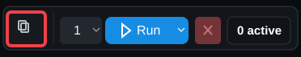
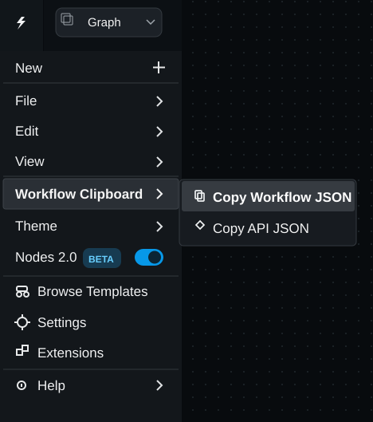

# ComfyUI Workflow Clipboard

A tiny **frontend-only ComfyUI extension** that copies the current **Workflow JSON** or **API JSON** straight to your system clipboard.

**One click. No export dialog. No Python dependencies.**

## Preview

Copy the current Workflow JSON directly from the action bar:



Or use the ComfyUI menu for either format:



## Features

- **Copy Workflow JSON**: copies the current ComfyUI workflow payload.
- **Copy API JSON**: copies the execution/API payload from `graphToPrompt().output`.
- **One-click action bar button** for Workflow JSON.
- Both commands are also available under the **Workflow Clipboard** menu.
- Preserves the workflow viewport state when ComfyUI's **Enable Workflow View Restore** setting is enabled.
- Clipboard fallback for environments where the modern Clipboard API is unavailable or blocked.
- Frontend-only: no `pip install`, `requirements.txt`, venv changes, network calls, or telemetry.

## Installation

### Git

From your ComfyUI `custom_nodes` directory:

```bash
git clone https://github.com/FlavienKlr/ComfyUI-WorkflowClipboard.git
```

Restart ComfyUI.

### Manual

1. Download this repository.
2. Extract it as `ComfyUI-WorkflowClipboard` inside your ComfyUI `custom_nodes` directory.
3. Restart ComfyUI.

## LLM / Agent-assisted installation

If you are using ChatGPT, Claude, Codex, or another coding agent with shell access, you can give it this instruction:

> Install `ComfyUI-WorkflowClipboard` from `https://github.com/FlavienKlr/ComfyUI-WorkflowClipboard` into the active ComfyUI `custom_nodes` directory. Do not install any Python dependencies or modify the Python environment. Restart ComfyUI after installation.

For agents, the installation itself is just:

```bash
cd /path/to/ComfyUI/custom_nodes
git clone https://github.com/FlavienKlr/ComfyUI-WorkflowClipboard.git
```

There are no Python dependencies to install. Do not run `pip install` for this extension.

Expected layout:

```text
ComfyUI/
└── custom_nodes/
    └── ComfyUI-WorkflowClipboard/
        ├── __init__.py
        ├── assets/
        │   ├── action-bar.svg
        │   └── menu.svg
        └── js/
            └── workflow_clipboard.js
```

## Usage

Click the **copy icon** in the ComfyUI action bar to copy the current Workflow JSON.

For either format, open the **Workflow Clipboard** menu and choose:

- **Copy Workflow JSON**
- **Copy API JSON**

Then paste the JSON wherever you need it: an editor, issue, chat, script, or another tool.

## How it works

The extension uses ComfyUI's frontend extension API and `app.graphToPrompt()`, serializes the selected payload as formatted JSON, and writes it to the system clipboard.

Nothing is uploaded or sent anywhere.

## Removal

Delete `custom_nodes/ComfyUI-WorkflowClipboard` and restart ComfyUI.

## License

[MIT](LICENSE)
